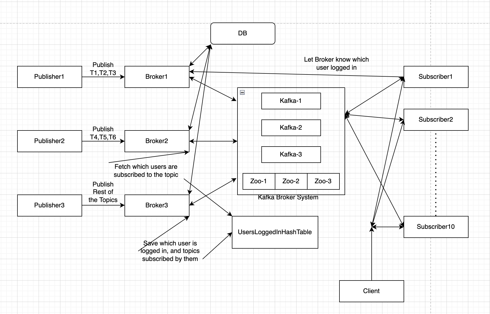
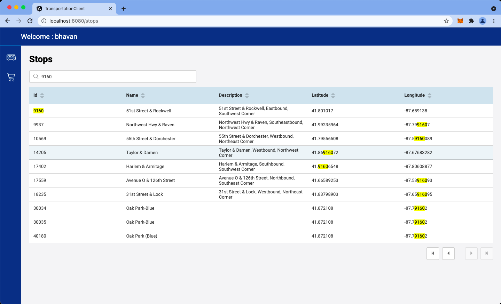
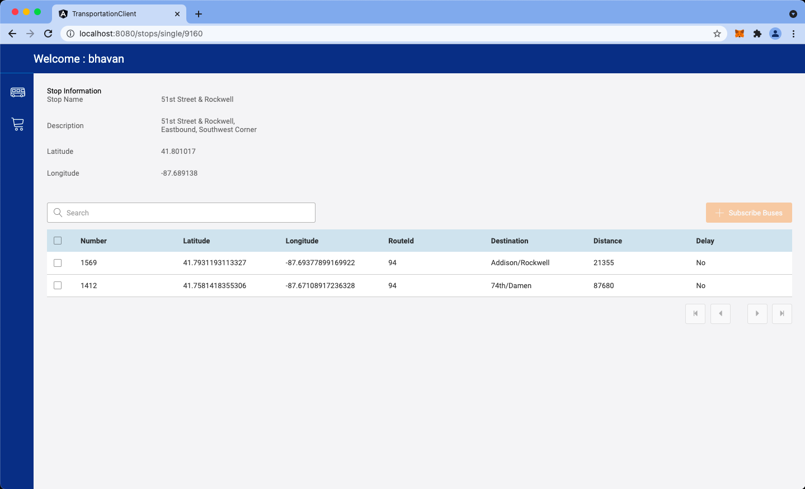
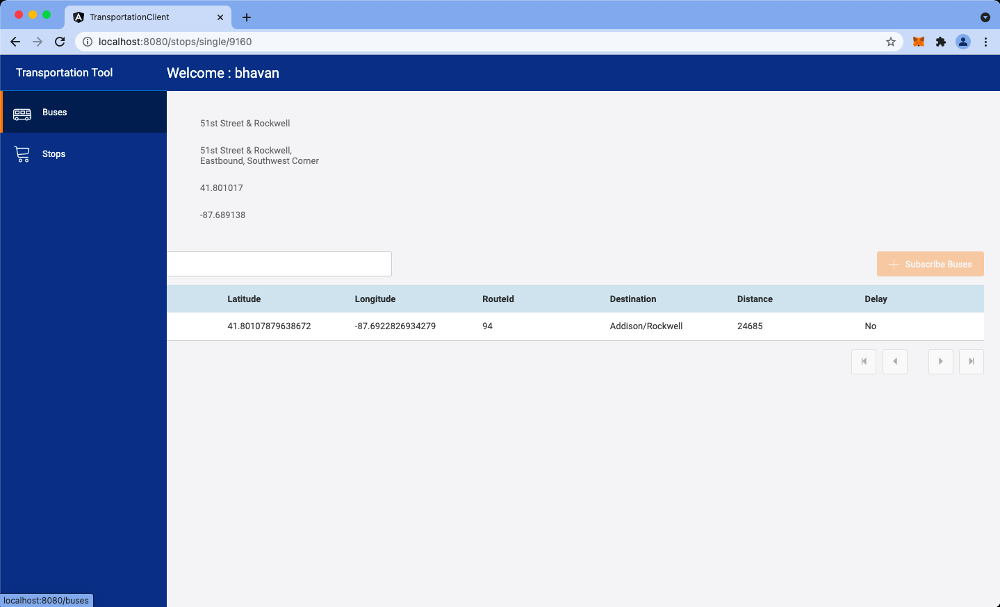
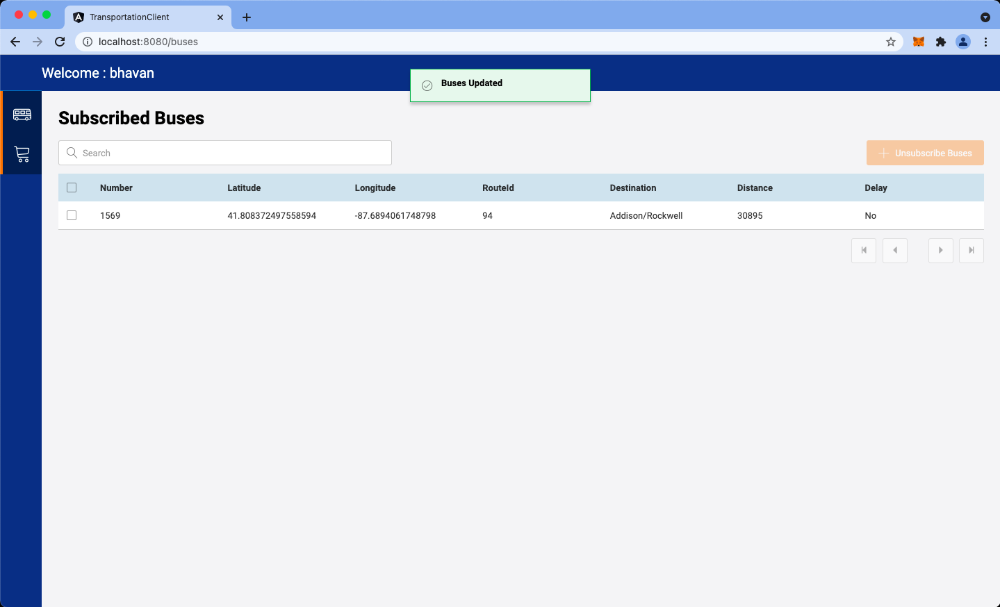
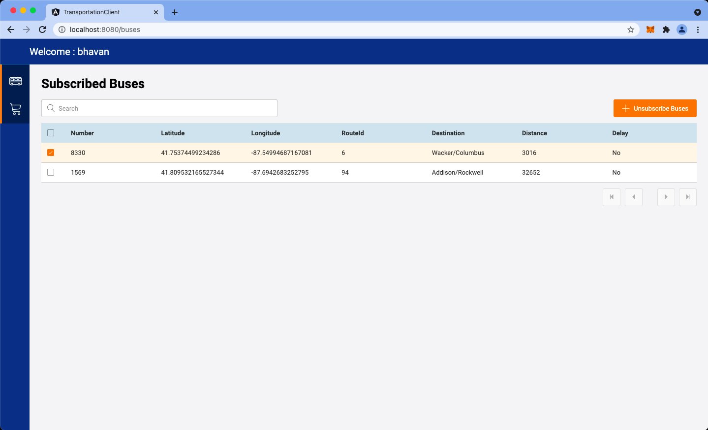
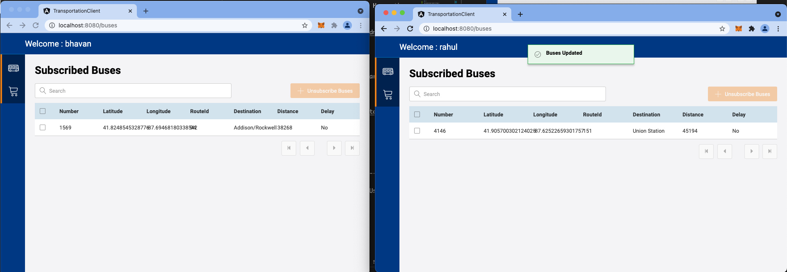

## Transportation Scheduling Updates(Bus Schedule Updates)
### Zip file contains the following files
- backend
- broker
- client
- db
- punlisher1
- punlisher2
- punlisher3
- subscriber
- docker-compose.yml
- README.md
- demo-recording-project2.mp4
<br />

### Architecture Diagram Project2
  


<br />

### Sequence Diagrams

* High Level Sequence Diagram
  

* Sequence Diagram explaination:
  * The client sends the bus ids (Topic Ids) to which the user subscribes to the backend
  * Backend saves the user subscriptions to the DB
  * Publishers runs every 1 min to fetch the bus info from the External API and sends it to the mediator
    * First two publishers takes up 3 topics each from the sorted list of the buses subscribed by all users, the last publisher publishes the rest of the buses location 
  * Broker saves the published data to the Db, and also checks the hash table to see if any logged in user requires that information, and adds it to the kafka brokers based on the user topics.
  * Client creates a websocket connection with the subscriber to get the data of the buses
  * Subscriber creates a new thread for every websocket opened by the client (so every user will have a seperate thread running of the subscriber), it listens to the data being published by the KafkaProducer.
  * Subscriber sends this information to the client to display

<br />

* User Login In           
  

<br />

* User Subscribe/ UnSubscribe
  

<br />

* Client Opening Connection Sequence Diagram
  

<br />

* Client Close Connection Sequence Diagram
  

<br />

### Distributed System Explaination:
* Each publisher publishes set of topics to respective brokers
* Broker saves the published data to the respective topic table in the DB
* Once user logs into the client application, a connection is created at random to one of the subscribers
* Once subscriber is connected to client, it sends a notification to a random broker to add the user details to the logged in users hash table 
* Each broker reads the hash table to see which all users need the topics handled by them, and adds the subscribed topics to the respective user topic of the Kafka Network
* The subscriber reads the respective logged in users topics from the kafka network and sends data back to client for display
  
NOTE: The user once logs out from the page, an event is triggered to clean up the hash table. This helps in reducing the number of Queues to be added by the broker even when the user is not logged in.

### Stack used:
- Frontend: Angular 9
- Backend/Publishers/Subscriber: Python, flask
- Database: MongoDb
- External Api: Chicago bus data
  
<br />
<br />

### Steps to run the project:

<br />
Step 1: Copy and extract the zip file into local system
Step 2: Run docker desktop 
Step 3: Go to the project directory

### Step 4: Run the following command in the terminal to run and deploy the application on docker
          
        docker-compose up

Step 5: Open http://localhost:8080/


Step 6: Login using any name (without any space)


Step 7: Click on the left icon to view stops.


Step 8: Open any stop to view current buses reaching the stop. (9160 stop number usually has buses always coming towards it)


Step 9: In the details of the Stop, Check the different buses displayed in the table format.


Step 10: Select buses which you want to subscribe to and click on the subscribe button.


Step 11: Go back to main menu and go to Bus Menu, to view the subscribed buses by the user.


Step 12: Observe when there is new location of the bus has been updated from the external API, there will be a toaster indicating the update and the location of the buses would get updated.



Step 13: To unsubscribe from getting updates for any bus, select the buses and click on unsubscribe button.



<br />
<br />

NOTE: We can login as multiple users and see different subscribed buses. Each user creats a new thread in the subscriber and also randomly connects to a different subscriber.


<br />

## Docker compose file Steps

The docker compose file runs the following commands to start up the project.
It deploys the following components


|        Component         | Port  |                                                   Description                                                   |
| :----------------------: | :---: | :-------------------------------------------------------------------------------------------------------------: |
|          redis           | 6379  |                              Used for communication between broker and subscriber.                              |
| transportation_mongodb_1 | 27017 |                                           Used for saving Data in DB.                                           |
|         database         | 5003  |                                      Used to inject base data into the DB                                       |
|         backend          | 5005  |                              The service used by the client to fetch information.                               |
|         broker1          | 7001  |  It is a broker to save data published by the publisher to the DB and sends it to kafka broker network.  |
|         broker2          | 7002  |  It is a broker to save data published by the publisher to the DB and sends it to broker network.  |
|         broker3          | 7003  |  It is a broker to save data published by the publisher to the DB and sends it to broker network.  |
|        publisher1        | 6001  |                                    It publishes first few records of buses.                                     |
|        publisher2        | 6002  |                                     It publishes next few records of buses.                                     |
|        publisher3        | 6003  |                                       It publishes the rest of the buses.                                       |
|       subscriber1        | 9001  | Subscribes to the buses information based on the user logged in, creates different threads for different users. |
|       subscriber2        | 9002  | Subscribes to the buses information based on the user logged in, creates different threads for different users. |
|       subscriber3        | 9003  | Subscribes to the buses information based on the user logged in, creates different threads for different users. |
|       subscriber4        | 9004  | Subscribes to the buses information based on the user logged in, creates different threads for different users. |
|       subscriber5        | 9005  | Subscribes to the buses information based on the user logged in, creates different threads for different users. |
|       subscriber6        | 9006  | Subscribes to the buses information based on the user logged in, creates different threads for different users. |
|       subscriber7        | 9007  | Subscribes to the buses information based on the user logged in, creates different threads for different users. |
|       subscriber8        | 9008  | Subscribes to the buses information based on the user logged in, creates different threads for different users. |
|       subscriber9        | 9009  | Subscribes to the buses information based on the user logged in, creates different threads for different users. |
|       subscriber10        | 9010  | Subscribes to the buses information based on the user logged in, creates different threads for different users. |
|         frontend         | 8080  |                      Is the client application which has the views displayed to the user.                       |


The following commands are run from the docker-compose file for different projects.
        docker build -t [image-name] .
        docker run -p port:port [image-name]

<br />

### Code snippets used to kafka

<br />

* To create a topic with three partitions
```
admin_client = KafkaAdminClient(bootstrap_servers=kafkaHost, api_version=(0, 11, 5))
topic_partitions[topic] = NewPartitions(total_count=3)
admin_client.create_partitions(topic_partitions)
```

* To publish data to created topic
```
producer = KafkaProducer(bootstrap_servers=kafkaHost,
          value_serializer=lambda v: json_util.dumps(v).encode('utf-8'), api_version=(0, 11, 5))

producer.send(publishNameSpace, value=busResponse)
```

* To subscribe data from created topic
```
consumer = KafkaConsumer(
        modPublishNameSpace,
        bootstrap_servers=[kafkaBroker1, kafkaBroker2, kafkaBroker3],
        auto_offset_reset='latest',
        enable_auto_commit=True,
        group_id="random-group",
        value_deserializer=lambda x: json_util.loads(x),
        api_version=(0, 11, 5))
```

Note: Subscriber and broker have only one folders. Using the advantage of docker builds to deploy the images multiple times for the same file using different configurations
